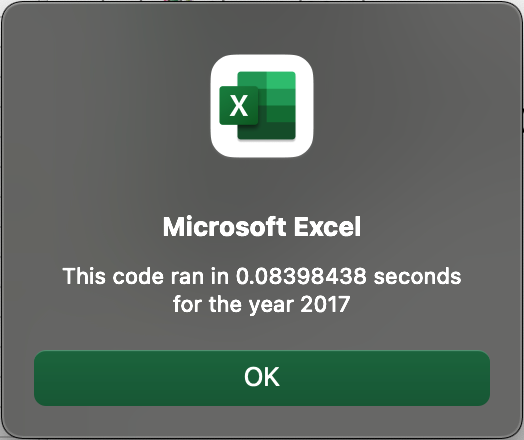
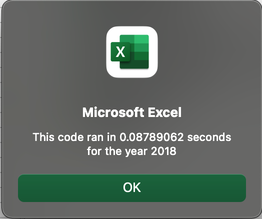

# VBA Code Refactoring to Improve Performance

## Overview of Project

The goal of this project was to improve the run times of the Stock Analysis macro through using arrays and indexes to perform more efficiently.  The functionality of the initial code was maintained, but the approach was modified to speed up processing time.  

## Results

Compared to the initial macro, the refactored code ran dramatically faster by using arrays and indexes.  The initial run times with the original code clocked in at 0.86 seconds for both 2017 amd 2018 analyses.  However, with the refactored code, the run times were redued to around 0.08 seconds for both years (an 85% reduction in time!)

### Run time - Refactored: 2017 Analysis

### Run time - Refactored: 2018 Analysis

The key differences is in setting up arrays to gather data across all tickers, as opposed to gathering and outputing data for each individual ticker one at a time.  

In the original code, the input and output steps were included within a loop that ran 12 times for each ticker:

### Code Snippet - Original

    '4. Loop through the tickers.

    For i = 0 To 11
    ticker = tickers(i)
    totalVolume = 0

    '5. Loop through rows in the data.

    Worksheets("2018").Activate
    For j = 2 To RowCount
    
     '5a. Find the total volume for the current ticker.
    
         If Cells(j, 1).Value = ticker Then
        
            'increase totalVolume by the value in the current row
            totalVolume = totalVolume + Cells(j, 8).Value
            
        End If
        
    '5b. Find the starting price for the current ticker.
        
        If Cells(j - 1, 1).Value <> ticker And Cells(j, 1).Value = ticker Then
        
            startingPrice = Cells(j, 6).Value
            
        End If
        
    '5c. Find the ending price for the current ticker.
        
        If Cells(j + 1, 1).Value <> ticker And Cells(j, 1).Value = ticker Then
        
            endingPrice = Cells(j, 6).Value
        
        End If
        
    Next j
        
    '6. Output the data for the current ticker.

        Worksheets("AllStocksAnalysis").Activate
            Cells(4 + i, 1).Value = ticker
            Cells(4 + i, 2).Value = totalVolume
            Cells(4 + i, 3).Value = (endingPrice / startingPrice) - 1

In the refactored version, an array is created to gather all of the required information across tickers in the initial loop, and then output in one single loop on the output page.

### Code Snippet - Refactored

    '1b) Create three output arrays
    Dim tickerVolumes(12) As Long
    Dim tickerStartingPrices(12) As Single
    Dim tickerEndingPrices(12) As Single
        
    ''2a) Create a for loop to initialize the tickerVolumes to zero.
   
    For i = 0 To 11
    tickerVolumes(i) = 0
    Next i
 
    ''2b) Loop over all the rows in the spreadsheet.
        Worksheets(yearValue).Activate
        For j = 2 To RowCount
    
        '3a) Increase volume for current ticker
        tickerVolumes(tickerIndex) = tickerVolumes(tickerIndex) + Cells(j, 8).Value
        
        '3b) Check if the current row is the first row with the selected tickerIndex.
        If Cells(j - 1, 1).Value <> tickers(tickerIndex) And Cells(j, 1).Value = tickers(tickerIndex) Then
            tickerStartingPrices(tickerIndex) = Cells(j, 6).Value
            
        End If
        
        '3c) check if the current row is the last row with the selected ticker
         'If the next row’s ticker doesn’t match, increase the tickerIndex.
        If Cells(j + 1, 1).Value <> tickers(tickerIndex) Then
            tickerEndingPrices(tickerIndex) = Cells(j, 6).Value
   
        '3d Increase the tickerIndex.
            tickerIndex = tickerIndex + 1

        End If
        
        Next j
    
    '4) Loop through your arrays to output the Ticker, Total Daily Volume, and Return.
        
        Worksheets("AllStocksAnalysis").Activate
        
        For i = 0 To 11
        tickerIndex = i
        Cells(i + 4, 1).Value = tickers(tickerIndex)
        Cells(i + 4, 2).Value = tickerVolumes(tickerIndex)
        Cells(i + 4, 3).Value = tickerEndingPrices(tickerIndex) / tickerStartingPrices(tickerIndex) - 1
        
        Next i

Separating these loops to be focused on gathering in one step, and outputing in a separate step seems to be the key difference in speeding up these run times.  

## Summary
The benefits of refactoring code are abundantly clear (and the value of arrays is very apparent).  Although there is additional work needed and added complexity in developing refactored code, the impact is undeniable.  This is a very small program, but the run times were reduced by 85%.  For computing processes that run significantly longer, an 85% reduction in processing time can mean a much larger time savings.  Especially if these are programs that are run multiple times, the benefits are significant and well worth the time invested up front to refactor the code.  

